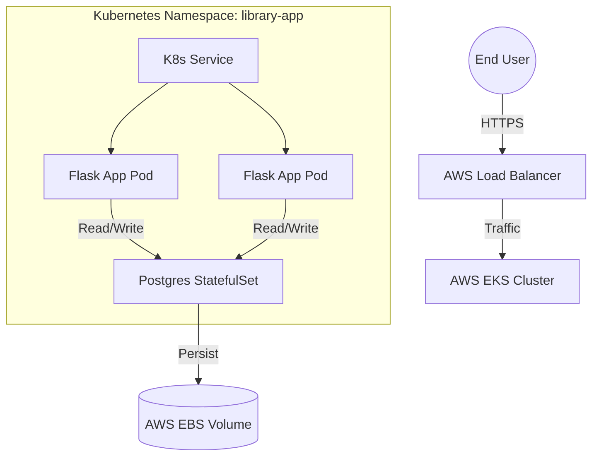

# 📚 Cloud-Native Library Management System (LMS)
### *From Monolith to Microservices-Ready Architecture on AWS EKS*


---

## 📖 Executive Summary

The **Library Management System (LMS)** is a comprehensive full-stack project designed to demonstrate the **modernization of legacy applications**.

Starting as a standard local Python Flask application backed by SQLite, this project has been re-architected into a **production-grade cloud-native solution**. It leverages **AWS EKS** for high availability, **Terraform** for reproducible infrastructure, and **Jenkins** for fully automated CI/CD pipelines.

### 🎯 Key Engineering Highlights
*   **Infrastructure as Code:** Complete AWS environment provisioning using modular Terraform.
*   **Zero-Downtime Deployments:** Rolling updates via Kubernetes deployments.
*   **Persistent Storage:** Stateful sets with AWS EBS CSI drivers for database reliability.
*   **Automation:** GitOps-style workflow triggered by GitHub Webhooks.

---

## 🏗️ System Architecture

The architecture follows a decoupled pattern where infrastructure is managed separately from application logic, united via a CI/CD pipeline.



---

## 🛠️ Technology Stack

| Layer | Technology | Description |
| :--- | :--- | :--- |
| **Frontend** | HTML5, CSS3, Jinja2 | Responsive UI with dynamic templating. |
| **Backend** | Python 3.9, Flask | RESTful logic and route management. |
| **Database** | PostgreSQL | Production-grade relational database. |
| **Containerization** | Docker | Multi-stage builds for optimized images. |
| **Orchestration** | AWS EKS (K8s v1.30) | Managed Kubernetes control plane. |
| **IaC** | Terraform | VPC, IAM, and Cluster provisioning. |
| **CI/CD** | Jenkins | Groovy-based pipelines for Build & Deploy. |

---

## 📂 Repository Structure (Monorepo)

This project adopts a **Monorepo** strategy to maintain code coherence.

```text
LMS/
├── app/                  # 🐍 APPLICATION LAYER
│   ├── app.py            # Main Flask Entrypoint
│   ├── Dockerfile        # Container definition
│   └── templates/        # Frontend assets
│
├── terraform/            # ☁️ INFRASTRUCTURE LAYER
│   ├── main.tf           # Root configuration
│   ├── modules/          # Reusable modules (VPC, EKS)
│   └── backend.tf        # S3 Remote State configuration
│
├── k8s/                  # ☸️ ORCHESTRATION LAYER
│   ├── 00-namespace.yml  # Isolation layer
│   ├── 03-postgres.yml   # StatefulSet definition
│   └── 04-flask-app.yml  # Application Deployment
│
└── pipelines/            # 🚀 AUTOMATION LAYER
    ├── Jenkinsfile.app   # CI/CD for the Application
    └── Jenkinsfile.infra # CI/CD for Terraform
```

---

## ✨ Application Features

### 👤 User Portal
*   **Secure Auth:** Session-based Login and Registration.
*   **Catalog:** Search books by title, author, or category.
*   **Borrowing:** Real-time book reservation and return system.
*   **Dashboard:** View personal transaction history.

### 🛡️ Admin Portal
*   **Inventory Management:** Full CRUD capabilities for the book catalog.
*   **User Oversight:** Manage user roles and permissions.
*   **Audit Logs:** View global transaction history and system logs.

---

## ☁️ Infrastructure as Code (Terraform)

We utilize Terraform to eliminate "ClickOps." The infrastructure is modular, scalable, and secure.

### 🔌 Modules
*   **VPC Module:** Provisions a custom VPC, Public/Private Subnets, NAT Gateways, and Route Tables.
*   **EKS Module:** Deploys the Control Plane, Worker Node Groups, and IAM OIDC Providers.

### 🚀 Deployment
```bash
cd terraform
terraform init
terraform plan -out=tfplan
terraform apply "tfplan"
```
> **Note:** State is stored remotely in **AWS S3** with **DynamoDB** locking to prevent race conditions in team environments.

---

## 🔄 CI/CD Automation (Jenkins)

The pipeline is designed for speed and reliability. It triggers automatically upon `git push` events.

### 🟢 Application Pipeline (`Jenkinsfile.app`)
1.  **Checkout:** Pulls the latest code from `main`.
2.  **Build:** Compiles the Docker image inside the `app/` context.
3.  **Push:** Uploads the artifact to Docker Hub.
4.  **Deploy:** Authenticates with AWS EKS and applies manifests from `k8s/`.
5.  **Rollout:** Performs a `kubectl rollout restart` to ensure zero downtime.

### 🟣 Infrastructure Pipeline (`Jenkinsfile.infra`)
1.  **Validate:** Checks Terraform syntax and validity.
2.  **Plan:** Generates an execution plan for infrastructure changes.
3.  **Apply:** (Gated) Applies changes to the AWS environment.

---

## ☸️ Kubernetes Implementation Details

The application is deployed into the `library-app` namespace.

*   **Database:** Deployed as a **StatefulSet** to ensure stable network IDs and ordered deployment. Data is persisted using `StorageClass` backed by **AWS EBS gp3** volumes.
*   **Application:** Deployed as a **Deployment** with multiple replicas for high availability.
*   **Networking:** Exposed via an **AWS Classic Load Balancer (CLB)** for external access.

---

## 🚀 How to Run Locally

If you wish to test the application logic without deploying to AWS:

1.  **Clone the Repo:**
    ```bash
    git clone https://github.com/MuhammedAhmedAbdulaziz/LMS.git
    ```
2.  **Run with Docker Compose:**
    ```bash
    cd app
    docker-compose up --build
    ```
3.  **Access:**
    Navigate to `http://localhost:5000`.
    *   **Admin Credentials:** `admin` / `admin123`

---

## 🔮 Roadmap & Future Improvements

*   [ ] **Microservices Split:** Refactor Auth and Catalog into separate services.
*   [ ] **Helm Charts:** Package the Kubernetes manifests for easier distribution.
*   [ ] **Observability:** Implement Prometheus and Grafana for cluster monitoring.
*   [ ] **Security:** Implement Network Policies and Git-Secrets scanning.

---

### 👨‍💻 Author

**Muhammed Ahmed Abdulaziz**
*DevOps Engineer | Cloud Enthusiast*

---
